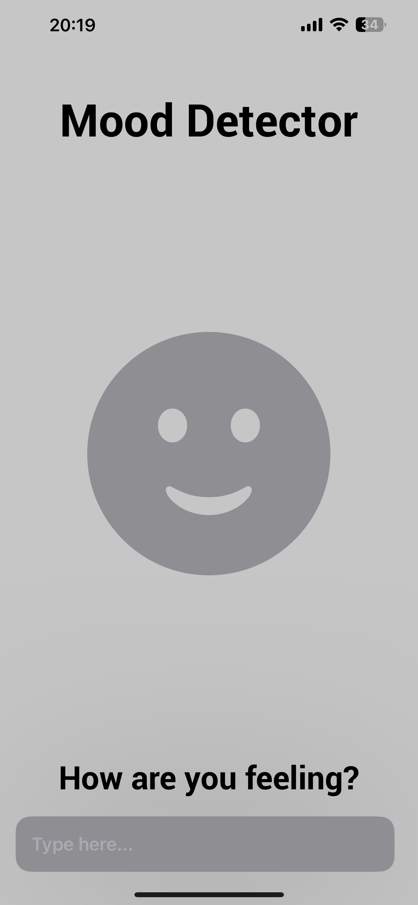
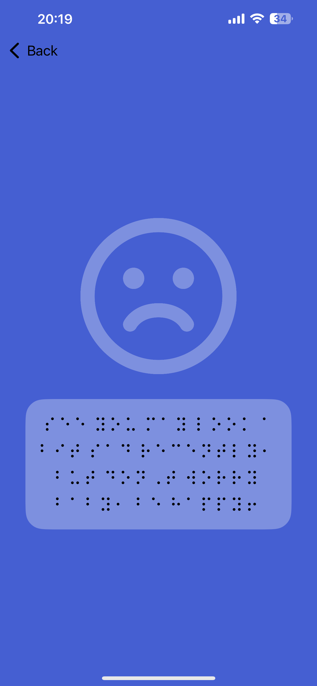
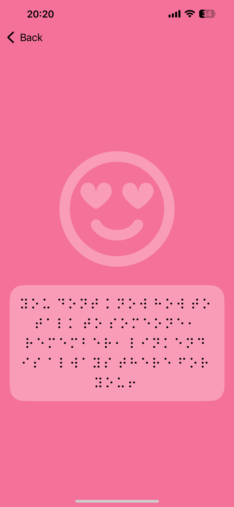
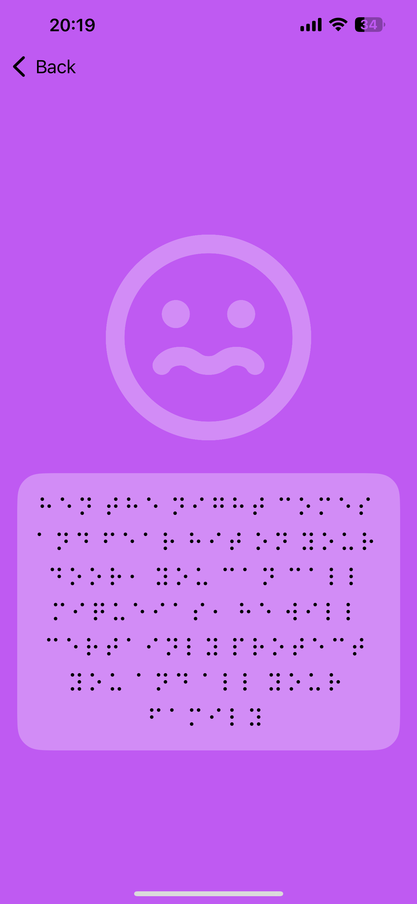
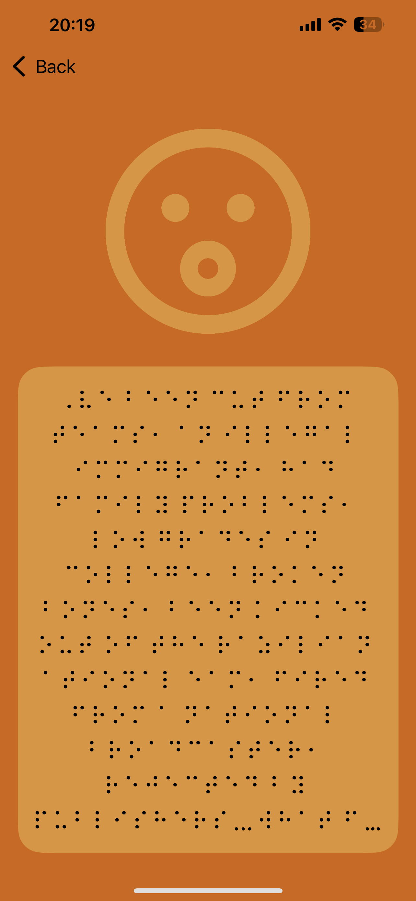
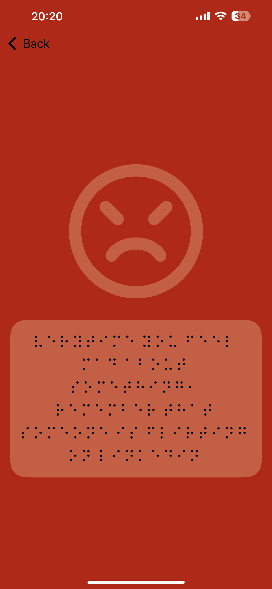
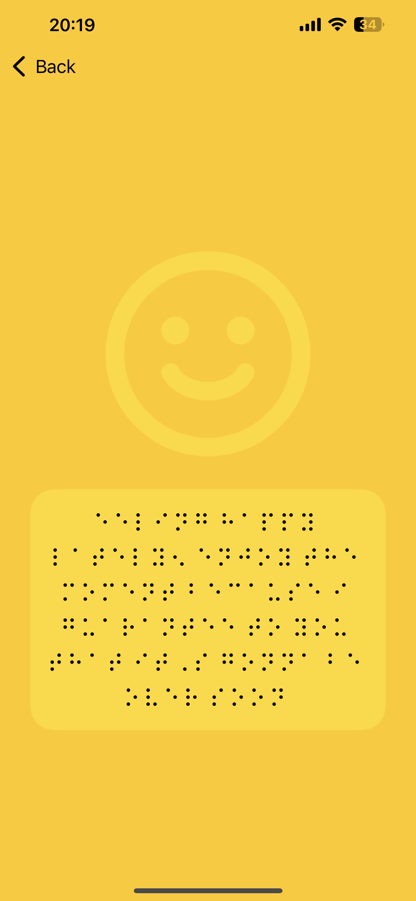

# Mood-Detector

O aplicativo para iOS Mood Detector foi criado com o intuito de aprender a treinar um modelo de Machine Learning. O app não possui utilidade prática e foi desenvolvido em Swift, utilizando o CreateML, CoreML e SwiftUI, com um [dataset](https://www.kaggle.com/datasets/nelgiriyewithana/emotions) de posts do Twitter. O projeto foi desenvolvido em equipe, junto com [@André](https://github.com/), [@João Pedro](https://github.com/), [@João Vitor](https://github.com/), [@Matheus Ricardo](https://github.com/) e [@Miqueias](https://github.com/). Após o usuário escrever o que está sentindo, ele é levado a uma página que o aconselha de acordo com o sentimento detectado pelo modelo. No entanto, para se manter fiel à proposta de ser um aplicativo sem utilidade, o conselho é dado em Braille — sistema de leitura e escrita tátil utilizado por pessoas cegas ou com baixa visão para ler e escrever.

## Tela Inicial
Página Inicial, onde o usuário pode descrevar a emoção sentida:

## Conselhos
Exibição dos conselhos, recebidos após a analise de nosso Modelo de Machine Learning

### Tristeza

### Amor

### Medo

 

### Surpresa

 

### Raiva

 

### Felicidade

 
